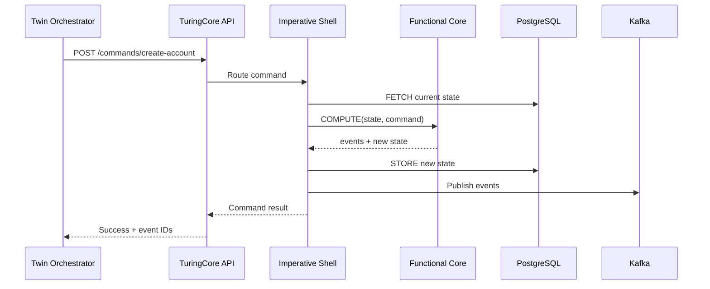
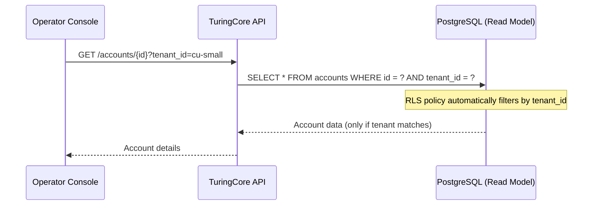
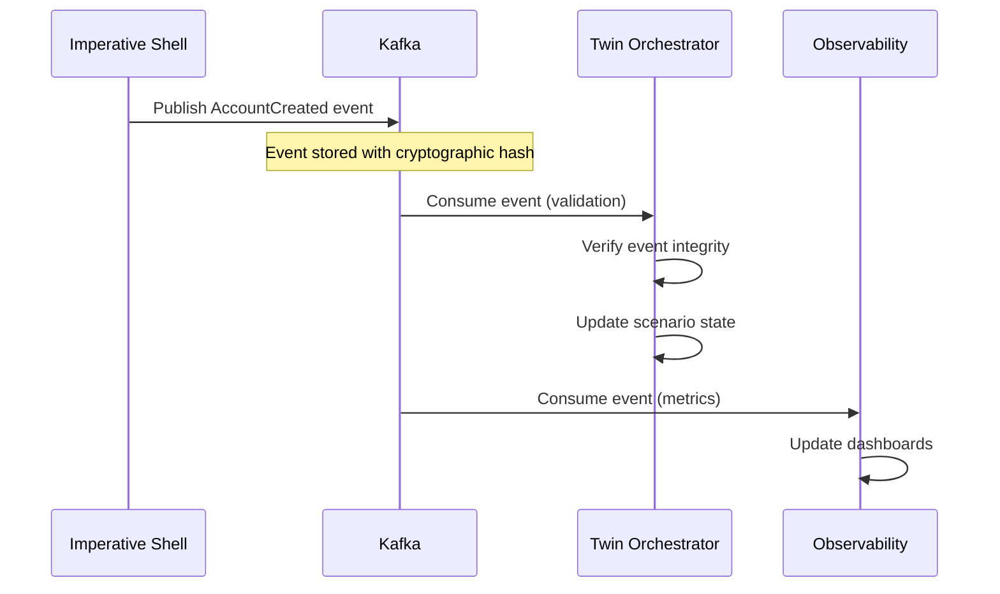

# Digital Twin Architecture

## Overview

The TuringCore CU Digital Twin is a **synthetic multi-tenant environment** that demonstrates TuringCore-v3's capabilities in a realistic credit union context. The architecture is designed to mirror production deployments while enabling safe experimentation, demonstration, and regulatory compliance validation.

## High-Level Architecture

```mermaid
graph TD
    subgraph AWS_EKS["AWS EKS Cluster (Digital Twin)"]
        subgraph CoreNamespace["Namespace: turingcore"]
            TC[["TuringCore-v3 Services<br/>(API, Event Engine, Projections)"]]
            PG[(PostgreSQL / Aurora<br/>+ RLS Tenants)]
            KAFKA[(Kafka / MSK<br/>Event Streams)]
        end

        subgraph TwinNamespace["Namespace: cu-digital-twin"]
            TO["Twin Orchestrator<br/>(Scenario Engine + Data Gen)"]
            OC["Operator Console<br/>(Back-Office UI)"]
            MP["Member Portal Demo<br/>(Web/PWA)"]
            OBS["Observability Stack<br/>(Prometheus / Grafana / Loki)"]
        end
    end

    TO -->|Commands / REST / gRPC| TC
    OC -->|Read APIs / Search| TC
    MP -->|Customer Flows<br/>(Onboarding, Payments)| TC

    TC -->|Events| KAFKA
    TO -->|Consume Events<br/>for validation| KAFKA
    OBS -->|Scrape Metrics| TC
    OBS -->|Logs & Traces| TC

    PG <-->|State Projections<br/>(read models)| TC
```

## Component Descriptions

### TuringCore-v3 Namespace

The `turingcore` namespace contains the core banking platform itself, deployed exactly as it would be in a production credit union environment.

#### TuringCore-v3 Services

**Stateless microservices** implementing domain logic:
- **Accounts Service:** Account management, balance queries
- **Customers Service:** Member/customer data management
- **Postings Service:** Double-entry accounting, transaction processing
- **Lending Service:** Loan origination, servicing, collections
- **Payments Service:** NPP, BPAY, card payments integration
- **Compliance Service:** AML/CTF monitoring, regulatory reporting
- **AI Agents:** Credit decisioning, fraud detection, portfolio management

All services follow the **FCIS (Functional Core, Imperative Shell)** pattern mandated by the Turing Protocol:
- **Functional Core:** Pure business logic, zero I/O, 100% testable
- **Imperative Shell:** I/O operations following FETCH → COMPUTE → STORE pattern

#### PostgreSQL / Aurora

**Database layer** with strict tenant isolation:
- **PostgreSQL Row-Level Security (RLS)** enforces tenant boundaries at database level
- **Read models** (CQRS projections) for optimized queries
- **Multi-tenant schema** with tenant_id on all tables
- **Automatic query filtering** ensures queries only return data for authenticated tenant

Example RLS policy:
```sql
CREATE POLICY tenant_isolation ON accounts
  USING (tenant_id = current_setting('app.current_tenant')::uuid);
```

#### Kafka / MSK

**Event streaming platform** for event sourcing:
- **40+ event types** capturing all state transitions
- **Partitioned by tenant_id** for parallelism and isolation
- **Cryptographic integrity** (SHA-256 hashing) for tamper detection
- **Complete audit trail** with deterministic replay capability
- **Canonical source of truth** for all monetary state transitions

### Digital Twin Namespace

The `cu-digital-twin` namespace contains components specific to the demonstration environment.

#### Twin Orchestrator

**Python-based scenario engine** that drives the digital twin:

**Responsibilities:**
- **Tenant provisioning:** Create synthetic credit union tenants via TuringCore API
- **Data generation:** Generate realistic customers, accounts, loans, transactions
- **Scenario execution:** Run time-warped scenarios (compress years into hours)
- **Event validation:** Consume Kafka events to verify system behavior
- **Compliance testing:** Validate Turing Protocol invariants

**Key Features:**
- **Declarative scenarios:** YAML-based scenario definitions
- **Realistic data:** Australian names, addresses, BSBs, account numbers
- **Time warping:** Accelerate time to simulate years of operations
- **Reproducibility:** Seeded random generation for consistent results

**Architecture:**
```
twin-orchestrator/
├── generators/          # Synthetic data generation
│   ├── customers.py     # Generate realistic members
│   ├── accounts.py      # Create accounts with balances
│   ├── loans.py         # Generate loan applications
│   └── transactions.py  # Simulate realistic transactions
├── scenarios/           # Scenario implementations
│   ├── base.py          # Base scenario class
│   ├── recession.py     # Economic downturn simulation
│   ├── fraud_spike.py   # Fraud attack simulation
│   └── outage.py        # CPS 230 resilience testing
└── api_client.py        # TuringCore API wrapper
```

#### Operator Console

**React/TypeScript web application** for back-office operations:

**Features:**
- **Multi-tenant dashboard:** Switch between credit union tenants
- **Customer search:** Find members across all tenants
- **Account management:** View balances, transactions, history
- **Event timeline:** Inspect raw event stream with cryptographic verification
- **Invariant monitoring:** Real-time compliance status (5 testable invariants)
- **Scenario control:** Trigger and monitor scenario execution
- **CPS 230/234 visualization:** Outage recovery, security incidents

**Technology Stack:**
- **Frontend:** React 18, TypeScript, TailwindCSS
- **State Management:** React Query for server state
- **API Client:** Auto-generated from OpenAPI spec
- **Charts:** Recharts for visualizations
- **Real-time:** WebSocket for live event updates

#### Member Portal Demo

**Reference digital banking UI** for CU-Digital tenant:

**Features:**
- **Digital onboarding:** KYC/identity verification, account opening
- **Account overview:** Balances, recent transactions, alerts
- **Transfers:** Internal transfers, NPP payments, BPAY
- **Loan applications:** Digital loan application with AI decisioning
- **Personal finance:** Spending insights, budgeting, categorization
- **Notifications:** Real-time alerts for transactions and events

**Technology Stack:**
- **Frontend:** React 18, TypeScript, TailwindCSS
- **Mobile-first:** Progressive Web App (PWA) with offline support
- **Authentication:** OAuth 2.0 / OpenID Connect
- **API Client:** TuringCore-v3 public APIs only

#### Observability Stack

**Monitoring and observability** for the entire digital twin:

**Components:**
- **Prometheus:** Metrics collection and alerting
- **Grafana:** Visualization and dashboards
- **Loki:** Log aggregation and querying
- **Jaeger:** Distributed tracing (optional)

**Key Dashboards:**

**1. TuringCore Overview**
- Platform-wide metrics (requests/sec, latency, error rate)
- Kafka lag and throughput
- Database connection pool usage
- Resource utilization (CPU, memory, network)

**2. Tenant SLO Tracking**
- Per-tenant latency percentiles (p50, p95, p99)
- Per-tenant error rates
- Per-tenant transaction volumes
- SLO compliance (99.9% availability target)

**3. Invariant Monitoring**
- **Invariant 1:** Balance Derivability (all balances derivable from ledger_events)
- **Invariant 2:** Event Integrity (cryptographic hash chain unbroken)
- **Invariant 3:** Tenant Isolation (no cross-tenant data leakage)
- **Invariant 4:** Idempotency (duplicate commands produce same result)
- **Invariant 5:** Audit Completeness (all state changes have events)

**4. Scenario Execution**
- Scenario progress and completion status
- Generated transaction volumes
- Expected vs. actual outcomes
- Performance during scenario execution

## Data Flow

### Command Flow (Write Path)



### Query Flow (Read Path)



### Event Flow (Event Sourcing)



## Multi-Tenant Isolation

### Database-Level Isolation (PostgreSQL RLS)

**Row-Level Security** ensures tenant isolation at the database layer:

```sql
-- Enable RLS on all tables
ALTER TABLE accounts ENABLE ROW LEVEL SECURITY;
ALTER TABLE transactions ENABLE ROW LEVEL SECURITY;
ALTER TABLE customers ENABLE ROW LEVEL SECURITY;

-- Create policy for tenant isolation
CREATE POLICY tenant_isolation ON accounts
  USING (tenant_id = current_setting('app.current_tenant')::uuid);

-- Set tenant context for each connection
SET app.current_tenant = 'cu-small-uuid';
```

**Benefits:**
- **Defense in depth:** Even if application logic fails, database enforces isolation
- **Zero trust:** Database never returns data for wrong tenant
- **Audit trail:** All queries logged with tenant context
- **Performance:** PostgreSQL optimizes RLS policies efficiently

### Application-Level Isolation

**Tenant context** injected into all operations:

```python
# Imperative shell extracts tenant from JWT
tenant_id = extract_tenant_from_jwt(request.headers['Authorization'])

# Set database session context
db.execute(f"SET app.current_tenant = '{tenant_id}'")

# All subsequent queries automatically filtered by RLS
accounts = db.query("SELECT * FROM accounts WHERE customer_id = ?", customer_id)
```

### Event Stream Isolation

**Kafka topics partitioned by tenant_id:**

```
ledger_events_cu_small_0
ledger_events_cu_small_1
ledger_events_cu_mid_0
ledger_events_cu_mid_1
```

**Benefits:**
- **Parallelism:** Each tenant can be processed independently
- **Isolation:** Tenant events never mixed in same partition
- **Scalability:** Add partitions as tenants grow
- **Replay:** Reconstruct single tenant state without affecting others

## Deployment Architecture

### AWS Infrastructure

```
VPC (10.0.0.0/16)
├── Public Subnets (10.0.1.0/24, 10.0.2.0/24)
│   └── NAT Gateways, Load Balancers
├── Private Subnets (10.0.10.0/24, 10.0.11.0/24)
│   └── EKS Worker Nodes
└── Database Subnets (10.0.20.0/24, 10.0.21.0/24)
    └── RDS/Aurora (Multi-AZ)

EKS Cluster
├── Managed Node Group (t3.xlarge, 3-10 nodes, auto-scaling)
├── Namespaces
│   ├── turingcore (TuringCore-v3 services)
│   ├── cu-digital-twin (Digital twin components)
│   ├── monitoring (Prometheus, Grafana, Loki)
│   └── ingress-nginx (Ingress controller)
└── Add-ons
    ├── AWS Load Balancer Controller
    ├── EBS CSI Driver
    └── VPC CNI

RDS Aurora PostgreSQL
├── Writer Instance (db.r6g.xlarge)
├── Reader Instance (db.r6g.xlarge, auto-scaling)
└── Multi-AZ deployment

MSK (Managed Streaming for Kafka)
├── 3 brokers (kafka.m5.large)
├── Multi-AZ deployment
└── Encryption at rest and in transit
```

### Kubernetes Architecture

```
turingcore namespace:
├── Deployments
│   ├── turingcore-api (3 replicas)
│   ├── turingcore-accounts (2 replicas)
│   ├── turingcore-customers (2 replicas)
│   ├── turingcore-postings (3 replicas)
│   ├── turingcore-lending (2 replicas)
│   └── turingcore-payments (2 replicas)
├── Services
│   ├── turingcore-api (ClusterIP)
│   └── turingcore-* (ClusterIP)
├── ConfigMaps
│   └── turingcore-config
└── Secrets
    ├── database-credentials
    └── kafka-credentials

cu-digital-twin namespace:
├── Deployments
│   ├── twin-orchestrator (1 replica)
│   ├── operator-console (2 replicas)
│   └── member-portal (2 replicas)
├── Services
│   ├── operator-console (ClusterIP)
│   └── member-portal (ClusterIP)
└── Ingress
    ├── operator-console.cu-digital-twin.example.com
    └── banking.cu-digital.example.com
```

## Security Architecture

### Network Security

- **VPC isolation:** Private subnets for all workloads
- **Security groups:** Least-privilege network access
- **Network policies:** Kubernetes-level network isolation
- **TLS everywhere:** All inter-service communication encrypted

### Authentication & Authorization

- **Service-to-service:** mTLS with service mesh (optional) or JWT tokens
- **User authentication:** OAuth 2.0 / OpenID Connect
- **API authorization:** Role-based access control (RBAC)
- **Database access:** IAM authentication for RDS

### Data Security

- **Encryption at rest:** All data encrypted (RDS, EBS, S3)
- **Encryption in transit:** TLS 1.3 for all connections
- **Secrets management:** AWS Secrets Manager or Kubernetes Secrets
- **Cryptographic integrity:** SHA-256 hashing of all events

### Tenant Isolation

- **Database RLS:** PostgreSQL Row-Level Security
- **Application context:** Tenant ID in all requests
- **Event partitioning:** Kafka topics partitioned by tenant
- **Audit logging:** All cross-tenant access logged and alerted

## Scalability

### Horizontal Scaling

- **Stateless services:** Scale to 100+ replicas if needed
- **Kafka partitions:** Add partitions as throughput grows
- **Database read replicas:** Auto-scaling Aurora read replicas
- **EKS nodes:** Cluster autoscaler adds nodes based on demand

### Performance Targets

- **API latency:** p95 < 100ms, p99 < 500ms
- **Event throughput:** 200,000 events/sec (documented)
- **Customer operations:** 46,000 customers/sec (documented)
- **Concurrent tenants:** 100+ tenants on single platform instance

### Resource Allocation

**Per-tenant resource limits** (configurable):
- **CPU:** 100m-500m per service
- **Memory:** 256Mi-1Gi per service
- **Storage:** 10GB-1TB per tenant (database)
- **Kafka partitions:** 1-10 per tenant

## Disaster Recovery

### Backup Strategy

- **Database:** Automated daily snapshots (7-day retention)
- **Kafka:** Replication factor 3, multi-AZ
- **Configuration:** GitOps (all config in version control)
- **Secrets:** AWS Secrets Manager with cross-region replication

### Recovery Procedures

**RTO (Recovery Time Objective):** 1 hour
**RPO (Recovery Point Objective):** 5 minutes

**Failure Scenarios:**
1. **Single pod failure:** Kubernetes automatically restarts (< 1 minute)
2. **Node failure:** Pods rescheduled to healthy nodes (< 5 minutes)
3. **AZ failure:** Traffic routed to healthy AZ (< 1 minute)
4. **Database failure:** Aurora failover to replica (< 30 seconds)
5. **Region failure:** Manual failover to DR region (< 1 hour)

### Event Replay

**Complete state reconstruction** from event stream:
```bash
# Replay all events for a tenant to rebuild state
python -m twin_orchestrator.main replay-events \
  --tenant-id cu-small \
  --from-timestamp 2025-01-01T00:00:00Z \
  --to-timestamp 2025-12-31T23:59:59Z
```

## Monitoring & Observability

### Key Metrics

**Platform Metrics:**
- Request rate (requests/sec)
- Error rate (errors/sec, %)
- Latency (p50, p95, p99)
- Saturation (CPU, memory, disk, network)

**Business Metrics:**
- Accounts created (per tenant)
- Transactions processed (per tenant)
- Loans originated (per tenant)
- Fraud alerts generated

**Compliance Metrics:**
- Invariant breach count (should be 0)
- Event integrity failures (should be 0)
- Tenant isolation violations (should be 0)
- Audit log completeness (should be 100%)

### Alerting

**Critical Alerts:**
- Invariant breach detected
- Tenant isolation violation
- Database unavailable
- Kafka lag > 1 minute
- Error rate > 1%

**Warning Alerts:**
- Latency p99 > 1 second
- CPU usage > 80%
- Memory usage > 80%
- Disk usage > 80%

## Cost Optimization

### Infrastructure Costs (Estimated)

**Monthly costs for digital twin environment:**

| Component | Configuration | Monthly Cost (AUD) |
|-----------|--------------|-------------------|
| EKS Cluster | Control plane | $110 |
| EC2 Instances | 3x t3.xlarge (on-demand) | $550 |
| RDS Aurora | db.r6g.xlarge (Multi-AZ) | $800 |
| MSK | 3x kafka.m5.large | $900 |
| Data Transfer | 1TB/month | $150 |
| **Total** | | **$2,510/month** |

**Cost optimization strategies:**
- Use Spot Instances for non-critical workloads (60-70% savings)
- Right-size instances based on actual usage
- Use Reserved Instances for stable workloads (30-40% savings)
- Implement auto-scaling to reduce idle capacity
- Use S3 for cold storage (event archives)

### Shared Infrastructure Economics

**Multi-tenant cost advantage:**

Traditional model (separate instance per CU):
- 4 credit unions × $2,510/month = **$10,040/month**

Multi-tenant model (shared platform):
- 1 platform serving 4 credit unions = **$2,510/month**
- **Cost per CU: $628/month (75% reduction)**

As tenant count grows, per-tenant cost decreases further:
- 10 tenants: $251/month per CU
- 25 tenants: $100/month per CU
- 50 tenants: $50/month per CU

---

## Summary

The TuringCore CU Digital Twin architecture demonstrates:

1. **True multi-tenant SaaS** with PostgreSQL RLS and Kafka partitioning
2. **Production-grade infrastructure** on AWS EKS with high availability
3. **Complete observability** with metrics, logs, and traces
4. **Regulatory compliance** with CPS 230/234 and CDR capabilities
5. **Scalability** to 100+ tenants on shared infrastructure
6. **Cost efficiency** through shared resources (75% reduction vs. dedicated instances)

This architecture serves as both a **demonstration environment** for prospects and a **validation environment** for TuringCore-v3 development.
